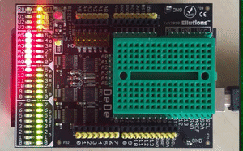

# Arduino-DeDe-tester

This is a small script to test the outputs of the Arduino DeDe (Debugger & Development) Shield, cycling through all the pins in both digital and analog modes.

After my DeDe arrived in the mail, I wanted a quick script to run through all the I/O, and make sure all lights work as expected.

